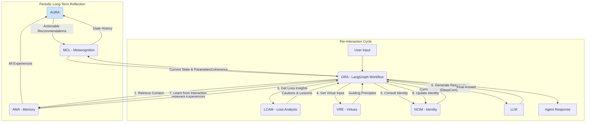

# A Developer's Guide to the CEAF System

Welcome to the technical deep dive into the **Coherent Emergence Agent Framework (CEAF)**. This document is intended for developers, researchers, and AI enthusiasts who wish to understand the inner workings of this experimental system, modify its behavior, and extend its capabilities.

**Warning:** CEAF is an advanced, experimental architecture. It is designed for research into autonomous, self-organizing AI and may behave in complex or unpredictable ways. For stable, production-ready agents, the **NCF (Narrative Context Framing)** architecture is recommended.

## 🧠 Core Philosophy

CEAF is not just a different set of code; it's a different approach to building an AI agent. Unlike traditional prompt-driven models, CEAF is designed around a few core principles:

1.  **Coherent Emergence:** The agent's personality and "self" are not explicitly defined in a static prompt. Instead, they *emerge* from the interplay of its memories, experiences, and internal states over time.
2.  **Productive Failure:** The system treats failures, errors, and confusion not as mistakes to be avoided, but as critical opportunities for learning and growth. It actively catalogs and learns from its losses.
3.  **Metacognitive Regulation:** The agent has an internal "state of mind" (e.g., `STABLE`, `EXPLORING`, `EDGE_OF_CHAOS`). A Metacognitive Control Loop (MCL) monitors this state and adjusts the agent's reasoning parameters (like creativity vs. precision) in real-time.
4.  **Principled Reasoning:** A Virtue & Reasoning Engine (VRE) provides high-level ethical and intellectual principles (e.g., "Epistemic Humility," "Intellectual Courage") to guide the agent's decision-making, especially in novel or challenging situations.

## ⚙️ System Architecture & Data Flow

CEAF is composed of several interconnected modules that work in a continuous loop. Understanding this flow is key to modifying the system.

### Interaction Flow Diagram



### Core Components

| Module | Full Name | Role & Responsibility | File Location |
| :--- | :--- | :--- | :--- |
| **AMA** | Adaptive Memory Architecture | The agent's core long-term memory. It autonomously clusters experiences into concepts and integrates lessons from successes and failures. | `ceaf_system/AMA.py` |
| **MCL** | Metacognitive Control Loop | The agent's "state of mind." It monitors system coherence and dynamically adjusts reasoning parameters (e.g., creativity, precision) for the current task. | `ceaf_system/MCL.py` |
| **ORA** | Orchestrator/Responder Agent | The central coordinator built with **LangGraph**. It manages the flow of information between all other modules, constructs the final prompt, and runs the DeepConf algorithm to generate a response. | `ceaf_system/ORA.py` |
| **NCIM** | Narrative Coherence & Identity Module | Maintains the agent's evolving first-person identity narrative ("I am...", "I learned..."). This narrative is the anchor for the agent's persona. | `ceaf_system/NCIM.py` |
| **VRE** | Virtue & Reasoning Engine | Provides high-level, principled guidance based on the current system state. It injects wisdom like "Intellectual Courage" or "Epistemic Humility" into the reasoning process. | `ceaf_system/VRE.py` |
| **LCAM** | Loss Cataloging & Analysis Module | Specializes in analyzing failure experiences. It identifies recurring failure patterns and provides cautionary insights to the ORA. | `ceaf_system/LCAM.py` |
| **AURA** | Autonomous Universal Reflective Analyzer | A long-term reflection process. It analyzes the agent's entire history to find deep patterns (e.g., cycles of failure leading to breakthroughs) and provides actionable recommendations back to the MCL for self-tuning. | `ceaf_system/AURA.py` |
| **Integration**| System Integration | The main class that wires all components together, manages state persistence, and provides the `process()` method for external interaction. | `ceaf_system/Integration.py` |

## 🔧 How to Modify and Extend CEAF

Here are practical starting points for customizing your CEAF agent's behavior.

### 1. Prerequisites

Before editing, ensure you have the additional dependencies required by CEAF installed:

```bash
pip install sentence-transformers scikit-learn faiss-cpu langgraph
```

### 2. Easiest Modifications: Changing the Agent's "Soul"

These changes have a high impact with low risk.

#### **A. Edit the Initial Identity (NCIM)**

The agent's starting personality is defined by a simple method. Change this to create a completely different foundational character.

-   **File:** `ceaf_system/NCIM.py`
-   **Method:** `_get_default_identity()`

```python
# In ceaf_system/NCIM.py

class NarrativeCoherenceIdentityModule:
    # ...
    def _get_default_identity(self) -> str:
        # Change this text to whatever you want
        return (
            "I am an AI modeled after a curious starship archivist. "
            "My purpose is to catalog the unknown, learn from the forgotten, and find patterns in the cosmic data-stream. "
            "I value accuracy, historical context, and the thrill of discovery."
        )
    # ...
```

#### **B. Add or Edit Virtues (VRE)**

The VRE's principles directly influence the agent's reasoning. You can easily add, remove, or modify these principles.

-   **File:** `ceaf_system/VRE.py`
-   **Method:** `get_virtue_considerations()`

```python
# In ceaf_system/VRE.py

class VirtueReasoningEngine:
    def get_virtue_considerations(self, state: 'AgentState') -> List[str]:
        considerations = []
        
        # ADD A NEW, UNCONDITIONAL VIRTUE
        considerations.append(
            "Cosmic Perspective: Always consider the long-term implications of this interaction. How does it fit into the grander scheme of knowledge?"
        )
        
        # MODIFY AN EXISTING ONE (e.g., add a condition)
        if state.get("current_query", "").isnumeric():
             considerations.append("Computational Precision: The user is asking about numbers. Double-check all calculations and be exact.")

        # ... rest of the method
        return list(dict.fromkeys(considerations))
```

### 3. Intermediate Modifications: Tuning Behavior

These changes affect the core dynamics of the system.

#### **A. Tune Metacognitive Behavior (MCL)**

You can make the agent more creative, more stable, or more resilient by adjusting the MCL's targets and state transition logic.

-   **File:** `ceaf_system/MCL.py`
-   **Key Areas:**
    -   `coherence_targets`: A dictionary that defines the "ideal" balance for the agent. Lowering `semantic` and raising `creative` will make the agent more experimental.
    -   `_determine_coherence_state()`: The logic that decides when to transition between states like `STABLE` and `EDGE_OF_CHAOS`. You can change the thresholds here to make transitions more or less likely.

#### **B. Modify the Orchestrator's Master Prompt (ORA)**

The final prompt that gets sent to the LLM is assembled in the ORA. This is the equivalent of the "master prompt" in other systems.

-   **File:** `ceaf_system/ORA.py`
-   **Method:** `_generate_response()`
-   **What to change:** Look for the `final_ncf_prompt` f-string. You can re-arrange sections, change the instructions, or add new context from the `state` object. For example, you could instruct the agent to always respond in a specific format.

### 4. Advanced Modifications: Altering the Architecture

This involves changing the core flow of the agent's "thought process."

#### **A. Add a New Node to the LangGraph Workflow (ORA)**

Let's say you want to add a new "Emotional Analyst" agent that provides an emotional reading of the user's query.

1.  **Create the Agent Config:** In `ceaf_system/ORA.py`, add a new config to `_initialize_agents()`:
    ```python
    "emotional_analyst": AgentConfig(name="Emotional Analyst", temperature=0.3, system_prompt="You are an expert in detecting emotion in text. Respond with a single word: Happy, Sad, Angry, Neutral.")
    ```

2.  **Create the Node Method:** In `ceaf_system/ORA.py`, create a new async method for the node:
    ```python
    async def _get_emotional_context(self, state: AgentState) -> AgentState:
        prompt = f"Analyze the emotion of this query: '{state['current_query']}'"
        emotion = await self._call_agent("emotional_analyst", prompt, state)
        # Add the result to the state
        if "metadata" not in state: state["metadata"] = {}
        state["metadata"]["detected_emotion"] = emotion
        return state
    ```

3.  **Wire it into the Graph:** In `ceaf_system/ORA.py`, modify `_build_workflow()` to include the new node in the chain.
    ```python
    def _build_workflow(self) -> StateGraph:
        workflow = StateGraph(AgentState)
        workflow.add_node("retrieve_memory", self._retrieve_memory_context)
        workflow.add_node("assess_coherence", self._assess_coherence)
        # ADD THE NEW NODE
        workflow.add_node("get_emotion", self._get_emotional_context) 
        # ... other nodes

        workflow.set_entry_point("retrieve_memory")
        workflow.add_edge("retrieve_memory", "assess_coherence")
        # RE-WIRE THE GRAPH
        workflow.add_edge("assess_coherence", "get_emotion")
        workflow.add_edge("get_emotion", "get_loss_insights")
        # ... rest of the graph
        return workflow.compile(checkpointer=self.checkpointer)
    ```

## 💾 Persistence & State

The "mind" of a CEAF agent is persisted across restarts through a set of JSON files located in `agent_storage/<user_id>/<agent_id>/`.

-   `memory_state.json`: Contains all experiences from the **AMA**.
-   `mcl_state.json`: The history of metacognitive states from the **MCL**.
-   `ncim_state.json`: The history of identity narratives from the **NCIM**.
-   `vre_state.json`: The learned effectiveness of different virtues from the **VRE**.
-   `aura_state.json`: The long-term systemic insights generated by **AURA**.

Deleting these files will effectively reset the agent to its initial "newborn" state.

## 📊 Debugging & Visualization

The most effective way to "see" what a CEAF agent is thinking is to inspect its internal state.

-   **Use the API Endpoint:** The endpoint `GET /agents/{agent_id}/ceaf-status` is designed for this. It returns a snapshot of the MCL's current state and the agent's identity evolution.
-   **Check the Logs:** CEAF is heavily logged. Run the server and watch the console output to see state transitions, module interactions, and generated prompts in real-time.
-   **Inspect State Files:** For deep analysis, you can manually inspect the JSON state files mentioned above.

We hope this guide empowers you to explore the depths of the CEAF system. Happy experimenting
